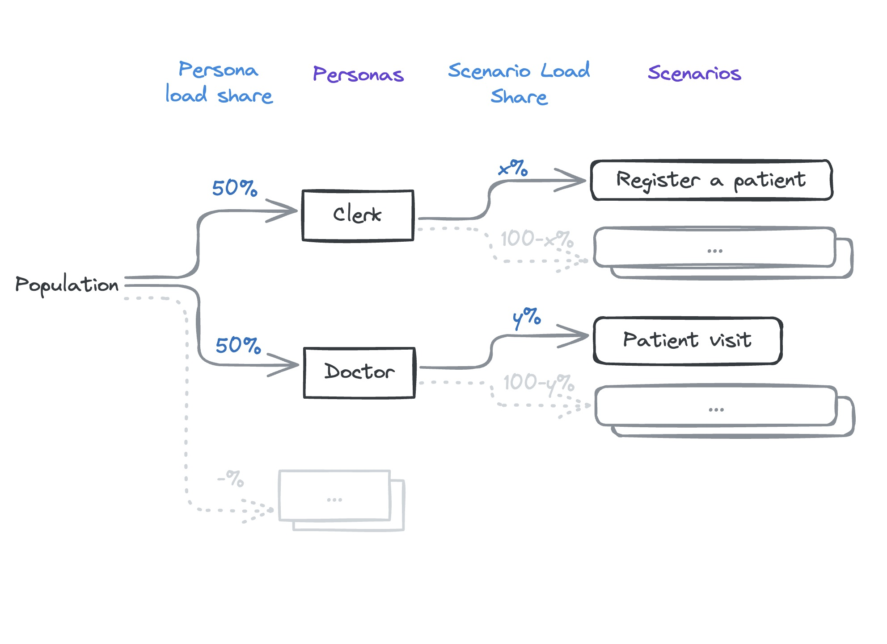

# Performance Testing for OpenMRS

This repository contains performance testing scripts and configurations for OpenMRS using Gatling.

The latest report can be found
at [openmrs.github.io/openmrs-contrib-performance-test](https://openmrs.github.io/openmrs-contrib-performance-test/)

## Table of Contents

- [Introduction](#introduction)
- [Getting Started](#getting-started)
    - [Prerequisites](#prerequisites)
    - [Running the Tests Locally](#running-the-tests-locally)
- [Debugging](#debugging)
- [Additional Resources](#additional-resources)

## Introduction

This project aims to facilitate performance testing for the OpenMRS platform. By using Gatling, it provides a scalable
and easy-to-use framework for simulating user load and measuring system performance.

## Getting Started

### Prerequisites

- Ensure you have OpenMRS running locally on port 80. (Use the docker file: [src/test/resources/docker-compose.yml](src/test/resources/docker-compose.yml))
- Java Development Kit (JDK) > 15 installed.
- Apache Maven installed.

### Running the Tests Locally

To run the performance tests locally, follow these steps:

1. Start OpenMRS on port 80. (Use the docker file: [src/test/resources/docker-compose.yml](src/test/resources/docker-compose.yml) It contains demo patients for the test. [Learn more](#generating-demo-patient-data))


For using the docker file, run the following command:
```bash
   docker compose -f src/test/resources/docker-compose.yml up
```
2. Execute the following command in your terminal:

   **Standard** `export SIMULATION_PRESET='standard' && ./mvnw gatling:test` \
   **dev**  `export SIMULATION_PRESET=dev TIER_COUNT=2 TIER_DURATION_MINUTES=1 USER_INCREMENT_PER_TIER=10 && ./mvnw gatling:test`

This command will initiate the performance tests using Gatling and generate a report upon completion.

### Simulation Presets

Simulation presets are configured within the OpenMRSClinic class. Below are the available presets. To add a new
simulation, define it in the OpenMRSClinic class.

During test runs, each simulation begins with 0 users and gradually increases by the specified user increment per tier
for one minute. It then runs with a constant number of users for the tier duration before ramping up again for one
minute to the next tier. This process continues until the final tier is reached.

| Preset       | Tier Count       | Tier Duration               | User increment per tier       | Ramp duration |
|--------------|------------------|-----------------------------|-------------------------------|---------------|
| standard     | 6                | 30 min                      | 32                            | 1 min         |
| commit       | 1                | 1 min                       | 20                            | 1 min         |
| pull_request | 1                | 1 min                       | 20                            | 1 min         |
| dev          | env `TIER_COUNT` | env `TIER_DURATION_MINUTES` | env `USER_INCREMENT_PER_TIER` | 1 min         |

In GitHub Actions, the commit and pull_request presets are used for commits and pull requests, respectively. The
standard preset is used for scheduled runs, which occur daily, updating the report at [o3-performance.openmrs.org](https://o3-performance.openmrs.org).

Currently, the workload is divided between the following Personas:

- Doctor: 50% of the active users
- Clerk: 50% of the active users



## Development


### Persona
A persona represents a role similar to a real-world individual, such as a Doctor, Nurse, Clerk, Junior Doctor, etc.

To create a new persona, extend the Persona class. Each persona should have its own registry [link to the section]. Below is an example implementation. A persona contains a list of scenarios [link to the section] that share the same registry.

```java
public class DoctorPersona extends Persona<ClerkRegistry> {

    public DoctorPersona(double loadShare) {
        super(loadShare);
    }

    @Override
    public List<Scenario<ClerkRegistry>> getScenarios() {
        return List.of(
            new PatientRegistrationScenario(0.4),
            new AppointmentBookingScenario(0.3),
            new LabResultsEntryScenario(0.3)
        );
    }
}
```
Personas are instantiated in a simulation class. You can provide the load share value to the constructor when instantiating the Persona. For example, if you want to allocate 75% of the population to the Clerk persona:

```java
new ClerkPersona(0.75);
```

The population for this persona is calculated as `Population * Persona load share`. \
For example, if there are 1000 users: \
`1000 * 0.75 = 750 clerks`

### Scenario
A scenario represents an activity a persona would perform in real life, such as a Clerk registering a patient, booking an appointment, entering lab results, etc.

To create a new scenario, extend the Scenario class. Like personas, scenarios are tied to a registry [link to the section]. You should override the getScenarioBuilder abstract method and write the scenario with Gatling. You can learn about registries in the registries section.

Here's an example:

```java
public class PatientRegistrationScenario extends Scenario<ClerkRegistry> {

    public PatientRegistrationScenario(float loadShare) {
        super(loadShare, new ClerkRegistry());
    }

    @Override
    public ScenarioBuilder getScenarioBuilder() {
        return scenario("Clerk")
            .exec(registry.login())
            .exec(registry.openHomePage())
            .exec(registry.openRegistrationPage())
            .exec(registry.registerPatient())
            // redirect to patient chart page
            .exec(registry.openPatientChartPage("#{patientUuid}"));
    }
}
```

Scenarios are instantiated in a Persona. When doing so, you can provide the scenario load share value to the specific scenario. For example, to distribute 40% of the Persona population to the Patient Registration Scenario:

```java
new PatientRegistrationScenario(0.4)
```

This is calculated as `Population * Persona load share * Scenario load share`.

For example, if there are 1000 users and the load share for the Clerk persona is 0.75:

`1000 * 0.75 * 0.4 = 300 clerks performing Patient Registration`.

### Registry
A registry is a set of actions performed in one or more scenarios, such as logging in, opening a page, filling out a form, etc. A single registry can be shared between multiple scenarios.

To create a new registry, extend the Registry class. A registry is tied to an HttpService. Common actions should be written in the registry class so that all inherited registries have access to them.

```java
public class ClerkRegistry extends Registry<ClerkHttpService> {

    public ClerkRegistry() {
        super(new ClerkHttpService());
    }

    public ChainBuilder openRegistrationPage() {
        return exec(
            httpService.getAddressTemplate(),
            httpService.getPatientIdentifierTypes(),
            httpService.getRelationshipTypes(),
            httpService.getModuleInformation(),
            httpService.getAutoGenerationOptions());
    }

    public ChainBuilder registerPatient() {
        return exec(
            httpService.generateOMRSIdentifier(),
            httpService.sendPatientRegistrationRequest());
    }
}
```

You can also create sub-registries by extending the classes. For example: JuniorDoctorRegistry extends DoctorRegistry.

## Debugging

Add the following line to the `logback.xml` file in the `src/test/resources` directory to enable debug logging:

```xml

<logger name="io.gatling.http.engine.response" level="DEBUG"/>
```


## Generating Demo Patient Data

Some scenarios require demo patients in the system, such as the "Visit Patient" scenario. There are several ways to achieve this:

1. Create patients within the scenario.
2. Create patients using the API before running tests.
3. Leverage demo data generation.

Option 3 was chosen because it helps generate patients with realistic data. Since this is a time-consuming task, the demo patients were pre-generated and saved as a database backup in the `src/test/resources/dump` directory. When you spin up the Docker container from the `src/test/resources/docker-compose.yml` file, the backup automatically loads into the database. Therefore, you don’t have to worry about generating and importing them manually.

If you wish to regenerate patients with a fresh database, you can do so either manually or automatically in GitHub Actions.

### To Generate Demo Patients Manually:

1. Navigate to the resources directory:
   ```bash
   cd src/test/resources/
   ```
2. Delete the existing database dump file:
   ```bash
   rm dump/dump.sql
   ```
3. Stop and remove the existing Docker container:
   ```bash
   docker-compose down -v
   ```
4. Pull the newest image and spin up the Docker container:
   ```bash
   docker-compose pull
   docker-compose up
   ```
5. Run the `set_demo_patient_count.sh` script to configure the `referencedemodata.createDemoPatientsOnNextStartup` global property. You can edit the patient count as needed:
   ```bash
   sh set_demo_patient_count.sh
   ```
6. Restart the Docker container and wait until all data is generated. Note that this is a time-consuming task:
   ```bash
   docker-compose restart
   ```
7. Export the patient UUIDs to a CSV file. This file will be used in `src/test/java/org/openmrs/performance/scenarios/VisitPatientScenario.java`:
   ```bash
   sh export_patient_uuids.sh
   ```
8. Take a database dump and replace the current one:
   ```bash
   sh export_db_dump.sh
   ```

### To Generate Demo Patients Automatically on GitHub:

The process is automated with the following workflow:

[Generate Demo Patients Workflow](https://github.com/openmrs/openmrs-contrib-performance-test/tree/main/.github/workflows/generate-demo-patients.yml)

1. Visit the workflow page: [Generate Demo Patients Workflow](https://github.com/openmrs/openmrs-contrib-performance-test/actions/workflows/generate-demo-patients.yml).
2. Click the "Run Workflow" button.

This process may take approximately 4 hours to complete and will automatically commit the database dump and patient UUIDs to the repository.


## Additional Resources

- For more detailed information on using Gatling, refer to the [Gatling documentation](https://gatling.io/docs/).
- View a demo report of the performance tests [here](https://omrs-performance-report.surge.sh/).

Feel free to contribute to this project by submitting issues or pull requests. Happy testing!
