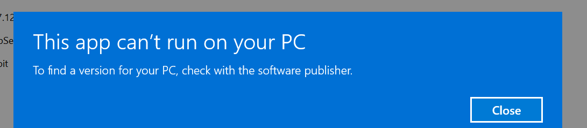
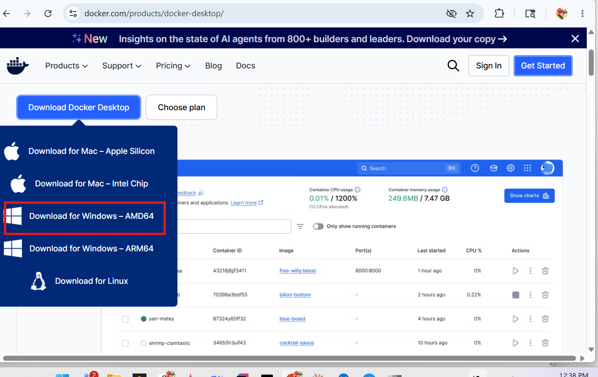
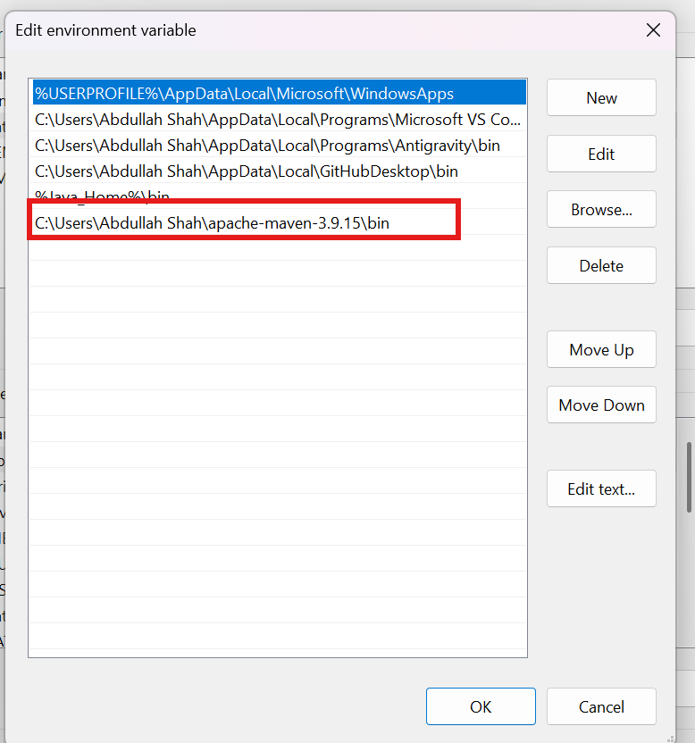

# Troubleshooting Guide

This guide documents common issues encountered while setting up the
openmrs-contrib-performance-test project locally on Windows,
along with their solutions.

**Tested on:**
- OS: Windows 11
- Processor: Intel Core i5 10th Generation
- RAM: 8GB
- Docker Desktop: v29.4.2
- Apache Maven: 3.9.15
- Java: OpenJDK 26.0.1

---

## Table of Contents

1. [Wrong Docker Installer Downloaded](#1-wrong-docker-installer-downloaded)
2. [Maven Not Recognized After Installation](#2-maven-not-recognized-after-installation)
3. [mvnw Not Recognized on Windows](#3-mvnw-not-recognized-on-windows)
4. [cd Command Not Switching to Another Drive](#4-cd-command-not-switching-to-another-drive)
5. [Build Interrupted Due to Network Issue](#5-build-interrupted-due-to-network-issue)
6. [Docker Desktop Icon Not Green](#6-docker-desktop-icon-not-green)

---

## 1. Wrong Docker Installer Downloaded

**Problem:**
When running the Docker Desktop installer, Windows shows:
```
This app can't run on your PC.
To find a version for your PC, check with the software publisher.
```

**Cause:**
The Docker download page offers two versions for Windows:
- **AMD64** — for Intel and AMD processors
- **ARM** — for ARM-based processors (e.g., Snapdragon, Apple M1/M2)

Downloading the ARM version on an Intel machine causes this error.

> !

**Fix:**
Download the correct AMD64 installer directly from:
```
https://desktop.docker.com/win/main/amd64/Docker%20Desktop%20Installer.exe
```

**How to identify your processor type:**
1. Press `Win + R`, type `dxdiag`, press Enter
2. Under the **System** tab, check **Processor**
3. If it says Intel or AMD → download **AMD64**

---

## 2. Maven Not Recognized After Installation

**Problem:**
After installing Apache Maven, running `mvn -version` shows:
```
'mvn' is not recognized as an internal or external command,
operable program or batch file.
```

**Cause:**
Maven's `bin` folder was not added to the Windows System PATH,
or the terminal was not restarted after adding it.

**Fix:**

**Step 1 — Find your Maven bin folder path.**
Example: `C:\Users\YourName\apache-maven-3.9.15\bin`

**Step 2 — Add it to System PATH:**
1. Search **"environment variables"** in the Windows Start menu
2. Click **"Edit the system environment variables"**
3. Click the **"Environment Variables"** button
4. Under **"System variables"**, select **"Path"** → click **"Edit"**
5. Click **"New"** and paste your Maven bin path
6. Click **OK → OK → OK**

> 
**Step 3 — Open a NEW terminal** (important — old terminal won't update):
```
mvn -version
```

Expected output:
```
Apache Maven 3.9.15
Java version: xx.x.x
```

---

## 3. mvnw Not Recognized on Windows

**Problem:**
Running the standard Unix command fails on Windows:
```
'.' is not recognized as an internal or external command,
operable program or batch file.
```

**Cause:**
The `./mvnw` syntax is for Linux/Mac terminals. Windows Command Prompt
does not support it.

**Fix:**
Use `mvnw.cmd` instead on Windows:
```bash
mvnw.cmd install -DskipTests
```

---

## 4. cd Command Not Switching to Another Drive

**Problem:**
When the project is on a different drive (e.g., D:), running:
```
cd D:\CODING\GitHub\openmrs-contrib-performance-test
```
does nothing — the prompt stays on C: drive.

**Cause:**
In Windows Command Prompt, the `cd` command alone cannot switch drives.
You must switch the drive first.

**Fix:**
Run these two commands in order:
```bash
D:
cd CODING\GitHub\openmrs-contrib-performance-test
```

Verify you are in the correct folder:
```bash
cd
```
Output should show:
```
D:\CODING\GitHub\openmrs-contrib-performance-test
```

---

## 5. Build Interrupted Due to Network Issue

**Problem:**
During `mvnw.cmd install -DskipTests`, the internet disconnects
and the build stops midway. The cursor blinks but nothing happens.

**Fix:**
1. Press `Ctrl + C` to stop the current build
2. Reconnect your internet
3. Run the command again:
```bash
mvnw.cmd install -DskipTests
```
Maven caches already-downloaded dependencies locally, so the
retry will be faster than the first attempt.

---

## 6. Docker Desktop Icon Not Green

**Problem:**
Docker Desktop is open and shows **"Running"** in the window,
but the taskbar icon is not green.

**Cause:**
This is normal behavior on some Windows machines. The icon color
may vary, but if the Docker Desktop window shows **"Running"**,
Docker is working correctly.

**Fix:**
No fix needed. Verify Docker is running with:
```bash
docker --version
docker compose version
```

If both commands return version numbers, Docker is ready to use.

> 

---

## Still Stuck?

- Visit the [OpenMRS Community Forum](https://talk.openmrs.org)
- Open an issue on the [repository](https://github.com/openmrs/openmrs-contrib-performance-test/issues)